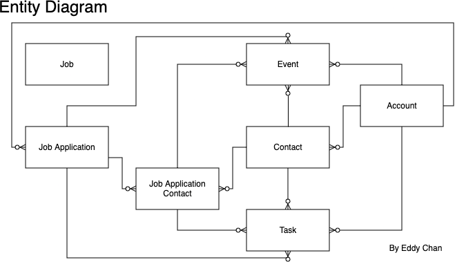

# Job Application Tracker on Salesforce 🚀

Dive into the Salesforce platform and channel its capabilities to redefine your job application tracking experience. This capstone project, a part of Cloud Code Academy's curriculum, aims to cultivate a proficient Salesforce developer out of you.

## About This Project 📖

Job searching can often become chaotic. With this project, we bring structure and efficiency into the process. Using Salesforce's versatile capabilities, you'll be building features that keep track of applications and add layers of automation, integration, and validation.

Key Features:
- Reminders: Set automated reminders for upcoming interviews, follow-ups, or essential dates.
- Validations: Assure the integrity of data with programmatic validations.
- Salary Calculations: Implement dynamic functionalities for salary calculations based on set parameters.
- Integration with Job Boards: Sync your application seamlessly with top job boards for updated tracking.

Navigating the Project 🧭

- Team or Solo: Opt to face this challenge solo or form a powerhouse team of up to three.
- Organizational Setup: Work within individual Salesforce orgs and religiously update the designated GitHub repository.
- Collaborate, But Stand Alone: While collaboration is the essence, ensure your team understands every project aspect.
- Reach Out: The ambiguous nature of requirements simulates the real world. Always clarify doubts with your instructor.

Key Recommendations 📝

- Embrace Ambiguity: Not all requirements might see completion - and that's okay!
- Management Tools: Organize and prioritize using tools like Trello or Jira.
- Code Over Click: Although tempting, emphasize coded solutions over Salesforce's declarative features.
- Fresh Start: Start with a fresh Trailhead Playground or Developer org to avoid existing automation or configuration.

## Installing the app using a Scratch Org

1. Set up your environment

    - Enable Dev Hub in your org
    - Install Salesforce CLI
    - Install Visual Studio Code
    - Install the Visual Studio Code Salesforce extensions

1. If you haven't already done so, authorize your hub org and provide it with an alias (**myhuborg** in the command below):

    ```
    sf org login web -a myhuborg -d
    ```

1. Clone the Job Application Tracker repository:

    ```
    git clone https://github.com/ChanEddyW/Job-Application-Tracker
    cd Job-Application-Tracker
    ```

1. Create a scratch org and provide it with an alias (**jat** in the command below):

    ```
    sf org create scratch -f config/project-scratch-def.json -a jat -y 30 -d
    ```

1. Push the app to your scratch org:

    ```
    sf project deploy start
    ```

1. Assign the **Job_Application_Tracker_User** permission set group to the default user:

    ```
    sf org assign permset -n Job_Application_Tracker_User
    ```

1. Schedule the **EventReminder** and **JobApplicationCleaning** jobs:

    ```
    sf apex run -f scripts/apex/EventReminderSchedulerJob.apex
    sf apex run -f scripts/apex/JobApplicationCleaningSchedulerJob.apex
    ```

1. Open the scratch org:

    ```
    sf org open
    ```

1. In App Launcher, click **View All** then select the **Job Application Tracker** app

## User Journey

Let's see how a job seeker named Jane would use this app at a high level

- To start her day, Jane checks her email and notices that the app sent her an email reminder for a scheduled interview tomorrow
- Then she launches the app which takes her to the home page
- She checks if she has any scheduled interview or task due today
- She also opens the calendar in a new tab so she can monitor it throughout the day
- She decides to find new jobs—so on the home page, she customizes the job search filters and clicks a button to do a new search
- Then she sees jobs from an external job board displayed in a table
- She sorts jobs by column, scans the table, and selects jobs to save as job applications
- Then she moves away from the home page to see job applications in a list view
- On the job applications list view, the job applications she saved have the status automatically updated to saved
- On a job application record page, she uses a take-home pay calculator, schedules interviews, creates tasks, sends emails, associates contacts, and updates fields
- While scheduling interviews, validation stops her from double-booking or scheduling interviews on the weekend
- After associating a job application with contacts, the primary contact is automatically set on the job application
- After changing a job application's status, a new task is automatically created
- While scanning job applications, she notices that stale job applications have the status automatically updated to closed and the notes field indicates that the job application was closed by an automated process

## Data Model



### Job (`Job__c`)

A custom object for temporarily storing jobs from an external job board

| Field         | Type                                         | Additional Info                              |
| ------------- | -------------------------------------------- | -------------------------------------------- |
| `Name`        | Auto Number                                  | Auto Number assigned after record is created |
| `Title__c`    | Text                                         | Job title                                    |
| `Location__c` | Text                                         | Job location                                 |
| `Snippet__c`  | Long Text Area                               | Job snippet                                  |
| `Salary__c`   | Text                                         | Job salary                                   |
| `Source__c`   | URL                                          | Job source                                   |
| `Type__c`     | Text                                         | Job type                                     |
| `Link__c`     | URL                                          | Job link                                     |
| `Company__c`  | Text                                         | Job company                                  |
| `Updated__c`  | Date/Time                                    | Date and time the job was last updated       |
| `Id__c`       | Text (External ID) (Unique Case Insensitive) | Job Id                                       |

### Job Application (`Job_Application__c`)

A custom object for storing job applications

| Field                     | Type                                         | Additional Info                                                                                                                                |
| ------------------------- | -------------------------------------------- | ---------------------------------------------------------------------------------------------------------------------------------------------- |
| `Name`                    | Auto Number                                  | Auto Number assigned after record is created                                                                                                   |
| `Status__c`               | Picklist                                     | Current status of the job application—valid values include `Saved`, `Applying`, `Applied`, `Interviewing`, `Negotiating`, `Accepted`, `Closed` |
| `Application_Date__c`     | Date                                         | Date when the application was submitted                                                                                                        |
| `Follow_Up_Date__c`       | Date                                         | When to follow up on the application                                                                                                           |
| `Notes__c`                | Long Text Area                               | For note-taking                                                                                                                                |
| `Rating__c`               | Picklist                                     | Current status of the job application—valid values include `5 Star`, `4 Star`, `3 Star`, `2 Star`, `1 Star`                                    |
| `Star_Rating__c`          | Formula (Text)                               | Display stars according to the `Rating__c` picklist value                                                                                      |
| `Position_Title__c`       | Text                                         | Specific job title or position being applied for                                                                                               |
| `Company__c`              | Lookup                                       | Represents the company where the job application is being sent                                                                                 |
| `Work_Model__c`           | Picklist                                     | Work model—valid values include `Remote`, `Hybrid`, `Onsite`                                                                                   |
| `Location__c`             | Text                                         | Job location                                                                                                                                   |
| `Job_Type__c`             | Picklist                                     | Job type—valid values include `Full-time`, `Temporary`                                                                                         |
| `Primary_Contact__c`      | Lookup                                       | Represents the main point of contact for the job such as a recruiter or an employee at the company                                             |
| `URL__c`                  | URL                                          | Web link of the job posting                                                                                                                    |
| `Job_Id__c`               | Text (External ID) (Unique Case Insensitive) | Job Id                                                                                                                                         |
| `Job_Description__c`      | Long Text Area                               | Detailed information about the job such as responsibilities, qualifications, benefits, etc.                                                    |
| `Salary__c`               | Number                                       | Expected salary for the job position                                                                                                           |
| `Federal_Income_Tax__c`   | Number                                       | Estimate of federal income tax                                                                                                                 |
| `Social_Security_Tax__c`  | Number                                       | Estimate of Social Security tax                                                                                                                |
| `Medicare_Withholding__c` | Number                                       | Estimate of Medicare withholding                                                                                                               |
| `Take_Home_Pay__c`        | Formula (Number)                             | Estimate of take-home pay                                                                                                                      |

### Job Application Contact (`Job_Application_Contact__c`)

A custom object for storing job application contacts

| Field                | Type        | Additional Info                                                                                |
| -------------------- | ----------- | ---------------------------------------------------------------------------------------------- |
| `Name`               | Auto Number | Auto Number assigned after record is created                                                   |
| `Contact__c`         | Lookup      | Represents a pivotal individual associated with the company such as a recruiter or an employee |
| `Job_Application__c` | Lookup      | Job Application associated with this contact                                                   |

## Helpful Resources 🛠️

- [Apex Developer Guide](https://developer.salesforce.com/docs/atlas.en-us.apexcode.meta/apexcode/apex_dev_guide.htm)
- [Salesforce Stack Exchange](https://salesforce.stackexchange.com/)
- [Visual Studio Code Documentation](https://code.visualstudio.com/docs)
- [Salesforce Extensions for Visual Studio Code](https://developer.salesforce.com/tools/vscode/)

Remember, the coding journey is filled with exploration, mistakes, learning, and growth. Enjoy this process, and here's wishing you success in your Salesforce journey with Cloud Code Academy! 🌟